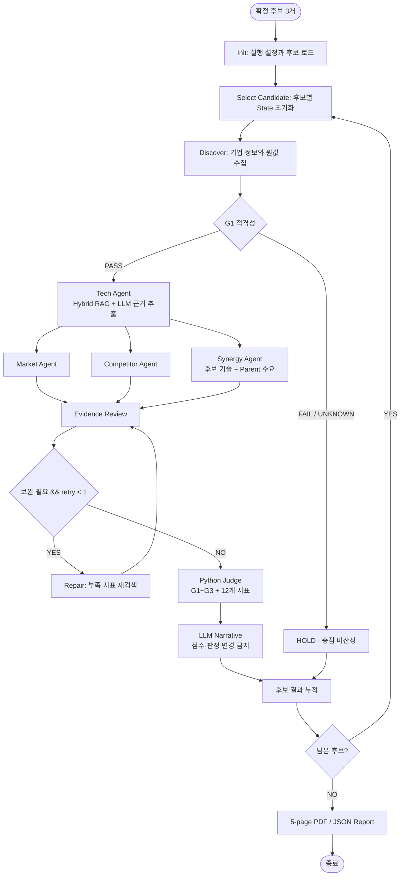

# AI Startup Investment Evaluation Agent

에너지·화학·배터리 제조기업의 CVC 관점에서 **정밀 조작 Physical AI 스타트업의 투자 가능성**을 평가하는 LLM 기반 Agentic RAG 시스템입니다.

평가 대상은 로봇 손·그리퍼, 힘·촉각 센서, VLA 기반 조작 지능 기업입니다. LLM의 주관적인 추천 대신, 공개 문서에서 찾은 원값과 출처를 Python 평가 규칙에 적용하여 재현 가능한 투자 검토 보고서를 생성합니다.


## Overview

- **Objective**: 창업팀, 기술력, 전략 시너지, 시장성, 트랙션, 경쟁 우위와 결격 위험을 기준으로 AI 스타트업 투자 적합성 평가
- **Domain**: Physical AI / Robotics - 로봇 핸드, 힘·촉각 센서, 휴머노이드, VLA 조작 지능
- **Candidates**: 에이로봇, 에이딘로보틱스, Figure AI
- **Method**: LangGraph Multi-Agent + Hybrid RAG + LLM 근거 추출 + Python Rule-based Judge
- **Output**: 후보별 점수·Gate·HOLD/INVEST·미확인 항목·후속 실사를 포함한 5페이지 PDF/JSON 보고서

## Why This Project?

일반적인 LLM 투자평가는 설명은 자연스럽지만 근거가 불명확하고 실행마다 판단이 달라질 수 있습니다. 이 프로젝트는 다음 원칙으로 그 문제를 줄였습니다.

1. 사전에 확정한 후보만 동일한 평가일과 규칙으로 비교합니다.
2. RAG는 점수가 아니라 **지표 계산에 필요한 원값과 원문 페이지**를 반환합니다.
3. 자료가 없으면 0으로 만들거나 추정하지 않고 `자료 없음`으로 남깁니다.
4. LLM은 검색 근거를 구조화하고 해설하지만, Python Judge가 Gate와 점수를 확정합니다.
5. 모든 보고서 인용은 State에 등록된 `source_id`와 연결됩니다.

## Features

- PDF 페이지 단위 파싱 및 원문 페이지 번호 보존
- 페이지 경계를 넘지 않는 450-token chunk와 60-token overlap
- BGE-M3 Dense Top20 + Kiwi BM25 Top20 Hybrid Search
- RRF `k=60` 순위 융합 후 Top5 근거 반환
- `candidate_id`·`doc_type` 기반 후보/기술/시장/모기업/위험 문서 필터
- 200페이지 문서 예산 자동 검증 - 현재 14개 문서, 161페이지, 197 chunks
- LLM 기반 기술·시너지 근거 추출과 근거 부족 시 후보당 1회 Repair
- 미등록 또는 누락된 `source_id`를 가진 LLM 주장은 폐기
- 3개 Gate, 6개 평가 항목, 12개 세부 지표의 결정론적 Python 채점
- 후보 전체 순환, 결과 누적 및 5페이지 투자평가 PDF/JSON 생성

## Evaluation Rules

### Gate

| Gate | 조건 |
|---|---|
| G1 적격성 | 비상장, Seed~Series B, Exit 미완료, 정상 영업 - Figure AI는 Series C 비교·분기 검증 사례 |
| G2 문제 적합성 | 후보의 실제 수행 작업과 모기업의 공개 작업 수요가 1개 이상 연결 |
| G3 결격 위험 | 현금·자본·제재·현장 필수 인증 관련 결격 조건 없음 |

### Score

| 평가 항목 | 가중치 | 지표 |
|---|---:|---|
| 창업자·팀 | 20% | T1 핵심 기술진 경력, T2 창업팀 선행 연구 |
| 제품·기술력 | 20% | K1 공개 연구, K2 실물 성공률, K3 제조 현장 실증 |
| 전략 시너지 | 20% | S1 작업군 수행, S2 모기업 수요 연결 |
| 시장성 | 15% | P1 시장 성장률 |
| 실적·트랙션 | 15% | R1 투자액, R2 국가 연구비, R3 고용 성장 |
| 경쟁 우위 | 10% | M1 유효 등록 특허 패밀리 |

세 Gate를 모두 통과하고 총점이 70점 이상일 때만 `INVEST`, 나머지는 `HOLD`입니다. 자료 없음은 임의 추정하지 않으며, 12개 지표 중 6개 이상이 없으면 정보 부족 경고를 표시합니다.

## Tech Stack

| 영역 | 기술 |
|---|---|
| Framework | LangGraph 1.x, Pydantic 2 |
| LLM / Generator | OpenAI Responses API, `gpt-4o-mini` - `.env`의 `OPENAI_MODEL`로 변경 가능 |
| Judge | Python deterministic rules - LLM Judge를 사용하지 않음 |
| Vector Store | FAISS cosine similarity |
| Sparse Retrieval | Kiwi tokenizer + BM25 |
| Fusion | Reciprocal Rank Fusion, `k=60` |
| Embedding | `BAAI/bge-m3`, 로컬 오픈소스 다국어 임베딩 |
| Report | Jinja2 + PyMuPDF, PDF/JSON |

## Retrieval Performance

운영 manifest와 일치하는 고정 평가셋 40문항으로 실제 측정했습니다.

| Metric | Result |
|---|---:|
| Questions | 40 - tech 16, market 12, parent 12 |
| Hit Rate@5 | **1.0000** |
| MRR@5 | **0.7442** |
| Mean latency | **62.07 ms** |
| p50 latency | **23.67 ms** |
| p95 latency | **28.42 ms** |
| Korean query → English document | 13문항, Hit Rate@5 **1.0000**, MRR@5 **0.6397** |

성능값은 `evaluation/results/investment_corpus_40.json`의 실제 실행 결과입니다. 모델 비교 실험은 수행하지 않았으므로 BGE-M3가 다른 모델보다 우수하다고 주장하지 않습니다.

## Agents

| Agent / Node | 역할 | 주요 출력 |
|---|---|---|
| Discover | 법인·투자·재무·고용 원값 확인 | G1, T1, R1, R3, F1~F3 |
| Eligibility | 적격성 PASS/FAIL/UNKNOWN 분기 | eligibility |
| Tech | 기술 문서 RAG 및 LLM 근거 추출 | T2, K1~K3, R2 |
| Market | 공식 한국 로봇시장 통계 분석 | P1 |
| Competitor | 등록 특허 패밀리와 경쟁 제품 비교 | M1 |
| Synergy | 후보 작업과 SK 계열 제조 수요 연결 | S1, S2, F4 |
| Review | 원값·기간·단위·출처·중복 검증 | repair targets |
| Repair | 부족 지표만 최대 1회 재수집 | 보완된 분석 결과 |
| Judge | Gate, 지표 점수, 총점, 판정 계산 | EvaluationRecord |
| Narrative | 확정 결과의 근거 기반 LLM 해설 | 인용 가능한 narrative |
| Report | 후보 전체 비교 보고서 생성 | PDF + JSON |

## Architecture



### RAG Pipeline

```text
PDF
  → page parsing
  → 450 tokens / overlap 60
  → BGE-M3 Dense Top20 ┐
                        ├→ RRF k=60 → Top5 → search_documents()
  → Kiwi BM25 Top20 ───┘
```

## Project Structure

```text
physical_agent/
├── agents/                 # Discover, Tech, Market, Competitor, Synergy, Narrative, Report
├── graph/                  # LangGraph builder, router, reducer
├── nodes/                  # Eligibility, Review, Repair, Judge, Archive 등 제어 Node
├── schemas/                # State, 근거, 평가 결과 공통 Pydantic Schema
├── rag/                    # PDF parsing, chunking, Dense/BM25/RRF, 검색 API
├── data/
│   ├── candidates.json     # 사전 확정 후보
│   ├── evidence/           # 기업·시장·특허 구조화 근거
│   └── rag/                # manifest, 공개 PDF, 로컬 index
├── evaluation/             # 40문항 검색 평가와 결과
├── prompts/                # Agent별 근거 추출·보고서 Prompt
├── reporting/              # HTML template, PDF/JSON renderer, output
├── tests/                  # 전체 190개 자동 테스트
├── app.py                  # 전체 실행 진입점
└── requirements.txt
```


## Actual Run Result

실제 OpenAI API와 운영 RAG 인덱스로 3개 후보를 end-to-end 실행했습니다.

| Candidate | Result | Score | 해석 |
|---|---|---:|---|
| AeiROBOT | HOLD | 20.0 | 공개 원값과 Gate 근거가 투자 기준을 충족하지 못함 |
| AIDIN Robotics | HOLD | 20.0 | 기술 자료는 있으나 투자 판단에 필요한 원값이 부족함 |
| Figure AI | HOLD | 미평가 | 구현 기준 Seed~Series B 밖인 Series C로 G1에서 심층 분석을 생략한 사례 |

전원 HOLD는 실패가 아닙니다. 자료가 부족한 상황에서 INVEST를 만들기 위해 원값이나 기준을 바꾸지 않은 결과입니다.

## Safety and Reliability

- LLM 출력의 `source_id`가 검색 결과에 없으면 해당 주장을 폐기합니다.
- LLM이 점수, Gate 또는 `INVEST/HOLD`를 변경할 수 없습니다.
- 자료 없음과 검증된 0건을 구분합니다.
- 한 후보의 분석값이 다음 후보에게 남지 않도록 State를 초기화합니다.
- 후보당 Repair 1회, 동일 지표 검색 횟수를 제한합니다.
- 최종 보고서는 State에 등록되고 실제 사용된 출처만 REFERENCE에 포함합니다.

## Lessons Learned

1. **좋은 RAG는 문서 수보다 지표 원값 coverage가 중요했습니다.** 기술 소개 문서가 많아도 성공 횟수·현금흐름·특허 패밀리가 없으면 투자 점수를 만들 수 없습니다.
2. **LLM과 계산 책임을 분리해야 재현성이 생깁니다.** LLM은 비정형 문서를 읽고 Python은 고정 규칙으로 판단하도록 나눴습니다.
3. **Agentic RAG에는 실패 경로가 필요합니다.** 근거 부족, 잘못된 JSON, 허위 source ID를 정상적인 `자료 없음` 상태로 처리해야 전체 Graph가 끝까지 실행됩니다.
4. **전원 HOLD도 유효한 결과입니다.** 평가 기준을 결과에 맞추지 않고, 부족한 근거를 후속 실사 항목으로 남기는 것이 투자평가 시스템의 신뢰성을 높였습니다.

## Contributors

- **조승현**: 도메인·투자평가 기준·Agent·RAG·State·Graph·보고서 구조 설계 및 설계 산출물 작성
- **김낙근**: PDF 파싱·청크 분할, BGE-M3·BM25·RRF 공통 RAG, 문서 필터·출처 관리 및 검색 평가
- **김도현**: LangGraph·State·Reducer·Router, 근거 검증·Repair, Python 투자 판단, 후보 순환 및 통합 실행
- **박세진**: 후보 정보 확인, 시장 분석, 경쟁 제품·특허 비교 및 기업·시장·재무 원값 수집
- **김진형**: 기술 분석, 모기업 전략 시너지, LLM 근거 추출, 최종 투자보고서 생성 및 PDF 출력
