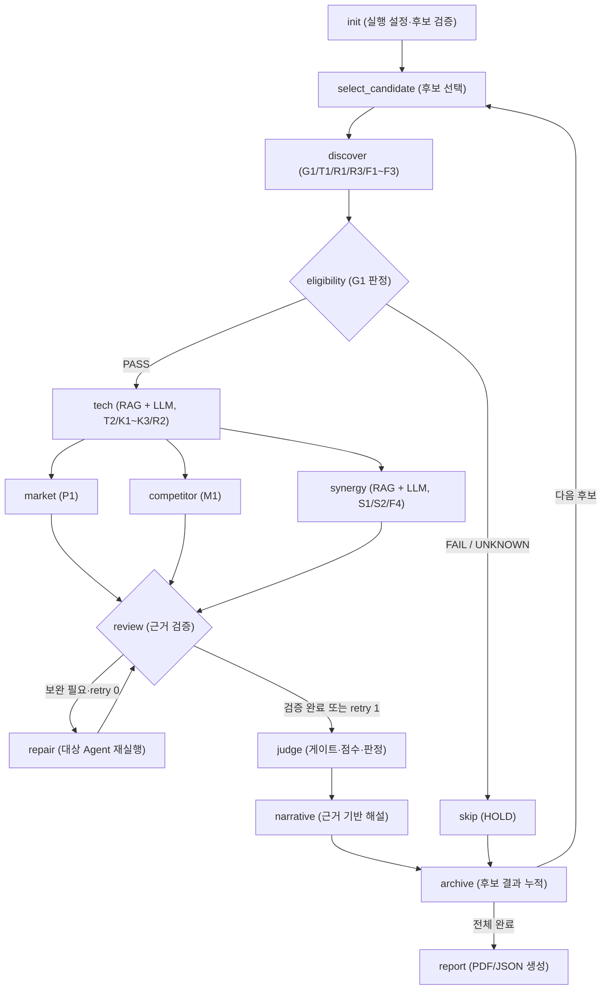

# Physical AI Startup Investment Evaluation Agent

본 프로젝트는 정밀 조작(Dexterous Manipulation) Physical AI 스타트업의 투자 가능성을 공개 근거로 평가하고, CVC 관점의 투자 심사 보고서를 생성하는 LangGraph 기반 Multi-Agent 시스템입니다.

## Overview

- **Objective**: 로봇 핸드, 힘·촉각 센서, 휴머노이드 상지 조작, VLA 스타트업의 적격성·기술성·시장성·경쟁력·재무 위험·제조 공정 시너지를 종합 평가합니다.
- **Method**: Agentic RAG로 원문 근거를 수집·구조화하고, LangGraph로 분석·검증·보완 순서를 제어한 뒤 Python 규칙으로 점수와 투자 여부를 결정합니다.

## Features

- **공식 근거 기반 분석**: 법인·투자·재무 자료, 특허, 시장 통계와 기술 문서를 후보·페이지·청크 단위 출처로 관리합니다.
- **Hybrid RAG**: BGE-M3 Dense 검색과 Kiwi BM25의 상위 결과를 RRF로 결합합니다.
- **LLM 근거 구조화**: OpenAI Responses API가 검색 문맥을 기술·시너지 지표의 구조화된 원값으로 변환합니다.
- **출처 검증**: LLM이 검색 결과에 없는 `source_id`를 인용하거나 근거 없는 값을 생성하면 해당 결과를 폐기합니다.
- **Review & Repair**: 단위, 기간, 분모, 중복과 출처 연결을 점검하고 후보당 최대 1회 담당 Agent를 재실행합니다.
- **결정론적 Judge**: LLM이 아닌 Python 코드가 G1~G3 게이트, 12개 평가지표와 100점 가중 점수를 계산합니다.
- **근거 제한 해설**: LLM은 확정된 점수와 판정을 변경하지 않고, 검증된 출처만 사용해 후보별 해설을 생성합니다.
- **자동 보고서**: 전체 후보의 `INVEST/HOLD`, 미확인 사항과 후속 실사 항목을 5쪽 PDF 및 JSON으로 출력합니다.

## Tech Stack

- **Framework**: LangGraph, Python 3.11
- **Schemas & Validation**: Pydantic v2
- **LLM / Generator**: OpenAI Responses API (`OPENAI_MODEL`, 기본값 `gpt-4o-mini`)
- **Judge**: Deterministic Python Scoring, `Decimal ROUND_HALF_UP`
- **Retrieval**: FAISS Dense Search + Kiwi BM25 + RRF
- **Retrieval Evaluation**: Hit Rate@5 `1.0000`, MRR@5 `0.7442` (고정 40문항)
- **Embedding**: `BAAI/bge-m3`
- **Reporting**: Jinja2, PyMuPDF
- **Testing**: Pytest, 전체 `190 passed`

## Agents

- **Discover Agent**: 법인 정보와 G1, T1, R1, R3, F1~F3 원값 및 출처 수집
- **Tech Agent**: T2, K1~K3, R2 검색 및 LLM 기반 근거 구조화
- **Market Agent**: 한국 도입 시장 공식 통계와 P1 3년 CAGR 산정
- **Competitor Agent**: 경쟁 제품 비교와 M1 유효 등록 특허 패밀리 산정
- **Synergy Agent**: 제조 작업군 S1~S2와 현장 인증 F4 분석
- **Review / Repair Node**: 근거 정합성 검증과 대상 Agent 1회 보완 실행
- **Judge Node**: G1~G3 게이트, 가중 점수와 `INVEST/HOLD` 판정
- **Narrative Node**: 확정된 평가와 출처에 한정한 투자 해설 생성
- **Report Node**: 전체 후보 결과를 PDF/JSON 보고서로 렌더링

## Architecture



## Directory Structure

```text
physical_agent/
├── agents/                # 분석 Agent와 투자 해설 Node
├── data/                  # 후보, 원천 근거, RAG 문서와 manifest
├── evaluation/            # 검색 평가셋과 측정 결과
├── graph/                 # LangGraph Builder, Router, Reducer
├── llm/                   # OpenAI Responses API 어댑터
├── nodes/                 # 적격성, 검증, 보완, 채점, 후보 순환
├── prompts/               # Agent별 근거 추출·보고서 프롬프트
├── rag/                   # 로딩, 청킹, 인덱싱, Hybrid 검색
├── reporting/             # PDF/JSON 렌더러와 HTML 템플릿
├── schemas/               # 공통 State와 데이터 모델
├── tests/                 # 단위·통합·Agentic RAG 테스트
├── app.py                 # 전체 실행 진입점
├── requirements.txt
└── .env.example
```

## Usage

Python 3.11 환경을 권장합니다.

### 1. 설치

```bash
python3.11 -m venv .venv
source .venv/bin/activate
python -m pip install --upgrade pip
python -m pip install -r requirements-dev.txt -r reporting/requirements.txt
```

### 2. 환경변수

`.env.example`을 복사한 뒤 발급받은 키를 입력합니다.

```bash
cp .env.example .env
```

```dotenv
OPENAI_API_KEY=your-api-key
OPENAI_MODEL=gpt-4o-mini
```

### 3. RAG 인덱스 생성

Apple Silicon Mac:

```bash
python -m rag.cli index \
  --manifest data/rag/manifest.csv \
  --index-dir data/rag/index/investment \
  --device mps \
  --batch-size 4
```

Linux 또는 Intel 환경에서는 `--device cpu`를 사용합니다.

### 4. 전체 실행

```bash
python app.py \
  --candidates data/candidates.json \
  --index data/rag/index/investment
```

모델을 직접 지정하려면 `--llm-model`, 보고서 경로를 지정하려면 `--report-output`을 사용합니다.

```bash
python app.py \
  --index data/rag/index/investment \
  --llm-model gpt-4o-mini \
  --report-output reporting/output/investment_report.pdf
```

API 비용 없이 구조만 확인하려면 `--skip-llm`을 사용합니다. RAG도 생략하려면 `--skip-rag`을 함께 사용합니다.

```bash
python app.py --skip-rag --skip-llm
```

결과는 기본적으로 `reporting/output/investment_report_<평가일>_<run_id>.pdf`와 같은 이름의 JSON 파일로 생성됩니다.

### 5. 테스트

```bash
python -m pytest -q
```

## Contributors

- **김낙근**: 공통 RAG, Hybrid 검색, 검색 성능 평가
- **김도현**: 공통 스키마, LangGraph, 검증·보완·채점, 통합 실행
- **박세진**: 후보 정보, 시장 분석, 경쟁사·특허 분석
- **김진형**: 기술 분석, 전략 시너지, 투자보고서 생성
- **조승현**: 전날 설계 산출물 작성
