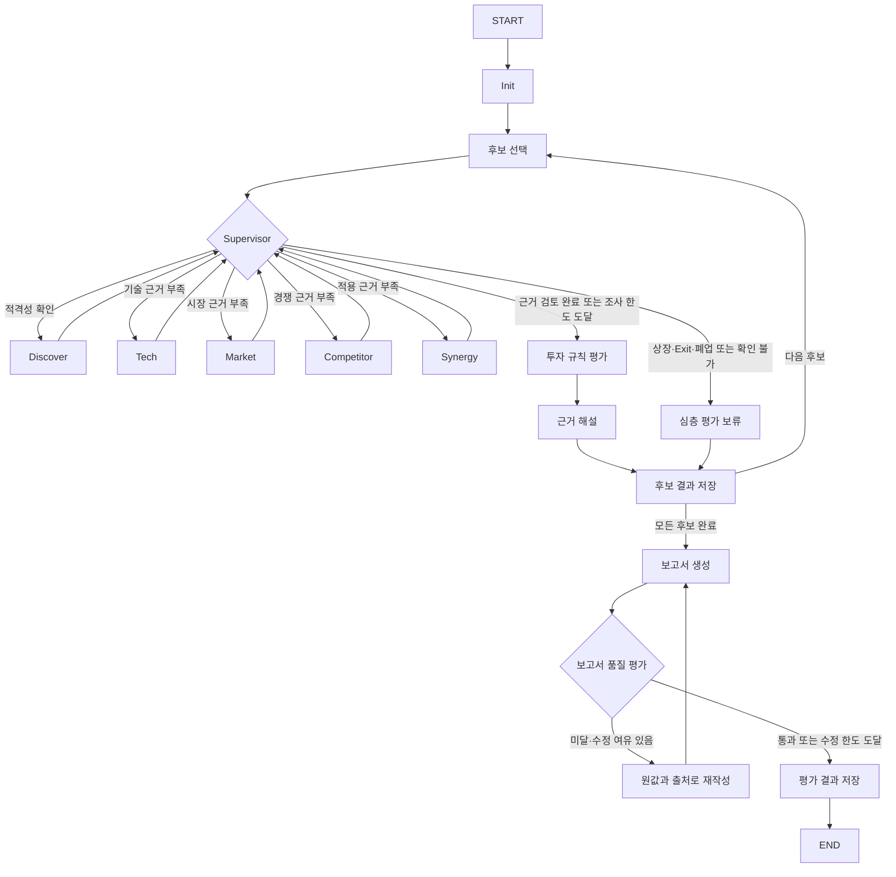

# Physical AI 스타트업 평가 — Supervisor

에너지·화학·배터리 제조기업의 CVC 관점에서 Physical AI 스타트업의 공개 근거를 검토하는 시스템입니다. 기존 RAG 실습의 검색기와 담당 에이전트를 재사용하고, LangGraph Supervisor가 현재 근거의 부족한 항목을 확인하여 다음 조사와 재작업을 결정하도록 변경했습니다.

이 브랜치는 `Multi-Agent Orchestration` 과제의 Supervisor 패턴을 구현합니다. 기존 순차·병렬 그래프는 `--workflow legacy`로 실행할 수 있습니다. 이전 실습의 구성과 측정값은 [이전 README](docs/supervisor/previous_rag.md)에 보관했습니다.

## 실행 구조


```mermaid
flowchart TD
    START --> Init --> Select[후보 선택]
    Select --> S{Supervisor}
    S -->|적격성 확인| Discover
    S -->|기술 근거 부족| Tech
    S -->|시장 근거 부족| Market
    S -->|경쟁 근거 부족| Competitor
    S -->|적용 근거 부족| Synergy
    Discover --> S
    Tech --> S
    Market --> S
    Competitor --> S
    Synergy --> S
    S -->|근거 검토 완료 또는 조사 한도 도달| Judge[투자 규칙 평가]
    S -->|상장·Exit·폐업 또는 확인 불가| Skip[심층 평가 보류]
    Judge --> Narrative[근거 해설]
    Narrative --> Archive[후보 결과 저장]
    Skip --> Archive
    Archive -->|다음 후보| Select
    Archive -->|모든 후보 완료| Report[보고서 생성]
    Report --> Quality{보고서 품질 평가}
    Quality -->|미달·수정 여유 있음| Revise[원값과 출처로 재작성]
    Revise --> Report
    Quality -->|통과 또는 수정 한도 도달| Finalize[평가 결과 저장]
    Finalize --> END
```

Supervisor는 규칙 기반으로 동작합니다. 기본 모드에서는 투자 단계만 범위 밖인 정상 비상장사도 비교 분석합니다. 상장·Exit 완료·휴폐업과 확인 불가 상태는 이 예외로 통과시키지 않습니다. 비교 분석 값은 `benchmark_score`에 저장하고 투자 점수 `total_score`와 구분합니다. 적격성 확인 뒤 미수행 관점을 우선 확보하고, 같은 조건에서는 미확인 필수 지표가 많은 담당자를 선택합니다. 에이전트의 실행 순서를 나열한 목록으로 제어하지 않습니다. 모든 담당 에이전트는 Supervisor로 복귀하며, 다른 담당자의 결과는 Supervisor가 명시적으로 전달한 경우에만 읽습니다.

근거가 부족하면 해당 담당자에게 부족한 지표와 사유를 전달합니다. 기본 호출 한도는 담당자당 최초 조사 1회와 보완 1회입니다. 한도에 도달해도 근거가 부족하면 `evidence_exhausted`로 기록하고 HOLD로 처리합니다. 이를 근거 충분성 통과로 간주하지 않습니다.

## 설치

Python 3.11 이상과 Git이 필요합니다. 아래 명령은 저장소 루트에서 실행합니다.

```bash
python3.11 -m venv .venv
source .venv/bin/activate
python -m pip install -r requirements-dev.txt
cp .env.example .env
```

`.env`에 `OPENAI_API_KEY`를 설정합니다. LangSmith를 사용하려면 `LANGSMITH_API_KEY`, `LANGSMITH_TRACING=true`, `LANGSMITH_PROJECT=physical-agent-supervisor`를 설정합니다. `.env`는 Git에서 제외되며 코드와 문서에 키를 기록하지 않습니다.

### API 없이 전체 흐름 확인

```bash
python app.py --skip-rag --skip-llm --run-id offline-check --evaluation-date 2026-10-13
```

저장된 기업·시장·특허 자료를 사용하여 그래프, 재조사, 보고서 생성과 품질 평가를 실행합니다. 이 실행은 실제 LLM·검색 성능 검증을 대신하지 않습니다. LangSmith가 설정되어 있으면 이 실행도 추적되며, 메타데이터에 오프라인 모드가 표시됩니다.

### RAG와 LLM을 포함한 실행

```bash
python -m scripts.prepare_corpus --manifest data/rag/manifest.expanded.csv
python -m rag.cli index --manifest data/rag/manifest.expanded.csv --index-dir data/rag/index-expanded
python app.py --run-id supervisor-live --evaluation-date 2026-10-13
```

원문은 manifest의 SHA256으로 확인합니다. 웹페이지에서 저장한 PDF는 재다운로드로 동일한 파일을 만들 수 없으므로 누락 시 원본 파일을 복원해야 합니다. `--available-only`는 확인된 자료만 별도 manifest에 기록하는 부분 검증 옵션입니다. 부분 자료로 실행한 결과는 전체 자료 검증으로 표기하지 않습니다.

같은 실행 ID로 결과를 덮어쓰지 않습니다. 새 실행에는 새 ID를 지정합니다. 중단한 실행은 다음과 같이 재개합니다.

```bash
python app.py --resume --run-id supervisor-live
```

적격성 탈락 후보의 분석을 기존처럼 생략하려면 `--eligibility-mode strict`를 지정합니다. 기본값은 `stage-benchmark`입니다.

재개 시 RAG·LLM 사용 여부와 적격성 모드는 원래 실행과 같아야 합니다. 저장된 State와 다음 노드를 SQLite에서 복원합니다. 완료한 실행을 재개하면 기존 결과를 반환합니다.

## 생성 파일

| 파일 | 내용 |
|---|---|
| `artifacts/<run-id>/report.r0.pdf` | 최초 보고서입니다. SUMMARY, 네 관점, REFERENCE를 포함합니다. |
| `report.r1.pdf`, `report.r2.pdf` | 품질 미달 시 생성한 수정본입니다. 수정하지 않으면 생성되지 않습니다. |
| `report.rN.json` | 해당 PDF의 구조화된 본문, 원값, 출처와 PDF 해시입니다. |
| `quality.json` | 회차별 품질 평가와 최종 통과 여부입니다. |
| `run.json` | 실행·추적 ID, 후보별 라우팅 사유와 종료 결과입니다. |
| `events.jsonl` | 실제 노드 실행 순서와 Supervisor 판단 기록입니다. |
| `checkpoints.sqlite` | 중단 후 재개하기 위한 State입니다. |

품질 평가 통과 시 종료 코드는 0입니다. 수정 한도 이후에도 미달이면 `quality_failed`와 종료 코드 2를 반환합니다. 이 경우 생성된 PDF는 검토용 결과이며 통과한 보고서로 제출하지 않습니다.

## 200페이지 문서와 초기 단계 비교

확장 manifest는 17개 문서, 사용 페이지 200페이지입니다. 기존 161페이지에 에이딘 소속 저자의 센서 논문 18페이지, BMW 고객 확인 자료 7페이지, 에이딘의 정량 사양 자료 14페이지를 추가했습니다. 원문 파일과 SHA256을 함께 관리합니다.

보고서에는 기존 투자 기준 점수와 `early-stage-v2` 비교 점수를 함께 표시합니다. 초기 단계 기준은 K1의 공개 정량 사양, K2의 조건이 명시된 실물 센서 시험, K3의 최근 공개 시연 기록을 각 항목 최대 2/5점으로 인정합니다. 제품 사양을 논문 수로, 센서 오차를 조작 성공률로, 전시 시연을 제조 현장 실증으로 바꾸지 않습니다. 이 비교 점수는 투자 판정에 사용하지 않습니다.

출처별 추가 근거와 수집 한계는 [문서 확장 기록](docs/supervisor/corpus_expansion.md)에 정리했습니다.

## 보고서 품질 기준

과제 안내의 **1안인 규칙 기반 평가**를 사용합니다. 출처의 존재와 연결성, 제한된 추천 표현, 발행기관 다양성, 불리한 근거와 미확인 항목의 표시, 후보별 네 관점의 포함 여부를 검사합니다. 파일의 무결성과 10페이지 상한도 검사합니다.

이 검사는 모든 문장의 의미가 원문으로 입증되는지 판정하는 LLM Judge가 아닙니다. 의미상 환각과 간접적인 편향은 사람이 추가로 검토해야 합니다. 초기 해설의 품질이 미달하면 검증된 원값과 인용을 중심으로 재작성합니다. 발행기관 부족처럼 재작성으로 해소되지 않는 문제는 계속 미달로 남습니다.

기존 투자 Judge는 점수와 Gate를 계산합니다. 이번 보고서의 중립성은 기술 우열을 단정하거나 기술을 추천하지 않는 것을 뜻합니다. 기존 HOLD/INVEST는 정해진 규칙의 계산 결과로 표시하며, 기술 우열과 구분합니다.

## 코드 구성

| 위치 | 책임 |
|---|---|
| `graph/supervisor.py` | Supervisor 그래프, 보수적 판정, 후보 결과 저장을 담당합니다. |
| `nodes/supervisor.py` | State를 읽고 다음 담당자와 재작업 사유를 결정합니다. |
| `agents/supervised.py` | 담당자별 입력을 제한하고 출력 계약과 실패를 처리합니다. |
| `schemas/supervisor.py` | 제어 상태, 할당 요청, 보고서, 품질 평가 모델을 정의합니다. |
| `graph/checkpoints.py` | SQLite 저장과 허용된 타입의 복원을 담당합니다. |
| `nodes/report_quality.py` | 보고서 생성 이후 품질 평가와 재작성 분기를 담당합니다. |
| `reporting/supervisor_report.py` | 네 관점의 PDF·JSON을 생성합니다. |
| `agents/`, `rag/`, `nodes/judge.py` | 기존 담당 에이전트, 검색기와 투자 규칙을 재사용합니다. |

담당자의 원값은 Judge에서 명시적으로 정규화하며, 실제 채점에 사용한 값은 JSON의 `scoring_values`에 저장합니다. 기술 설명은 정량 지표와 별도로 출처와 함께 보고서에 표시합니다.

설계 근거와 요구사항별 구현 위치는 [설계 문서](docs/supervisor/design.md)에 정리했습니다. 실제 검증 결과와 제출 자료는 [검증 기록](docs/supervisor/validation.md)에 기록합니다. 일곱 평가 항목을 대조한 결과는 [평가표 점검](docs/supervisor/rubric_audit.md)에 정리했습니다.

## 테스트

```bash
python -m scripts.prepare_corpus --manifest data/rag/manifest.expanded.csv
LANGSMITH_TRACING=false python -m pytest -q
```

신규 테스트는 근거에 따른 라우팅 변경, 특정 담당자 재조사, 통신 제약, 작업 실패 복구, 재시도 상한, 보고서 평가 루프, 지속적인 품질 미달, 파일 변조와 SQLite 재개를 확인합니다. 기존 테스트도 함께 실행합니다.

## Contributors

팀에서 확정한 담당 범위입니다. 기존 역할을 유지하며 아래 작업을 추가합니다. 이 표는 역할 배분이며 개인별 커밋 실적을 의미하지 않습니다.

| 팀원 | 기존 역할 | Supervisor 실습 추가 작업 | 기능 브랜치 |
|---|---|---|---|
| 조승현 | 도메인·투자평가 기준·Agent·State·Graph·보고서 설계입니다. | Supervisor 선정 근거와 trade-off, 네 관점 대응, 근거 충분성과 품질 평가 기준을 설계 문서로 정리합니다. | 기존 설계 역할을 유지합니다. |
| 김낙근 | 공통 RAG와 검색 도구입니다. | 부족 근거의 추가 검색, 출처·원문 페이지 추적, 재검색과 검색 품질 검증을 담당합니다. 근거 충분성 판정은 김도현 담당입니다. | `feature/rag` |
| 김도현 | 스키마·LangGraph·검증·Judge·통합 실행입니다. | Supervisor 동적 라우팅, 근거 충분성 판단과 재작업 요청, 보고서 품질 평가 노드와 실패 루프, 종료 가드·State·LangSmith 설정, 최종 통합과 README 취합을 담당합니다. | `feature/graph-judge` |
| 박세진 | Discover·Market·Competitor입니다. | 기존 세 Agent가 부족 항목과 재조사 요청을 처리하도록 보완하고 기업·시장·경쟁·특허 근거와 조회 상태를 반환합니다. | `feature/discover-market-competitor` |
| 김진형 | Tech·Synergy·Report입니다. | 기술·도메인 적용 근거의 재조사를 지원하고, 품질 평가 피드백을 반영해 보고서를 재작성하며 SUMMARY·REFERENCE와 PDF 출력을 검증합니다. | `feature/tech-synergy-report` |

품질 평가 노드의 담당자는 김도현이며, 평가 결과에 따른 보고서 수정의 담당자는 김진형입니다. README 최종 취합은 김도현 담당입니다. 조승현은 기존 Contributors의 설계 역할을 유지하며 별도 개인 역할 파일을 추가하지 않습니다.

착수와 통합 순서는 다음과 같습니다.

1. 조승현이 평가 기준을 정리하고 김도현이 State·재작업 요청·품질 평가 결과 형식을 확정합니다.
2. 김낙근·박세진·김진형이 기존 모듈을 공통 인터페이스에 맞춰 보완합니다.
3. 김도현이 통합하고 동적 라우팅·재조사·보고서 재작성 경로를 검증합니다.
4. 김도현이 실행 트레이스와 README를 준비하고 김진형이 최종 PDF를 준비합니다.

각자 기능 브랜치에서 커밋·push하고 김도현이 로컬 병합·검증 후 main에 반영합니다. 현재 `feat/supervisor-orchestration`은 통합 검토용 브랜치이며, 담당자별 브랜치의 개별 작업 이력을 대신하지 않습니다.

상세 역할과 기존 실습 기록은 [개발 역할분담](docs/개발_역할분담.md)에 정리했습니다. 실제 웹 화면 캡처는 [LangSmith 캡처 안내](docs/supervisor/langsmith_capture.md)에 따라 준비합니다.
